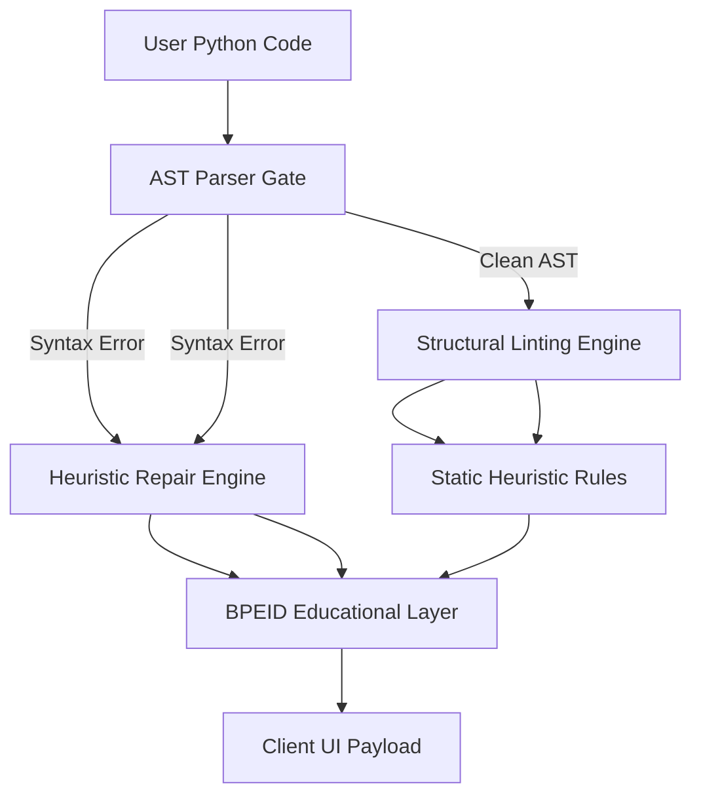

<div align="center">

# 💎 ACQR

### **AI-powered educational debugging assistant for beginner programmers**

*Open-source. Mentorship-first. Built to teach, not to replace.*
*Open-source. Mentorship-first. Built to teach, not to replace.*

<br />

[](https://fastapi.tiangolo.com)
[](https://react.dev)
[](https://microsoft.github.io/monaco-editor/)
[](https://opensource.org/licenses/MIT)

<br />

**[⚡ Try the Live Demo →](https://acqr-kappa.vercel.app/)**

<br />

[](https://acqr-kappa.vercel.app/)

</div>

---

## Why ACQR Exists
## Why ACQR Exists

Most AI coding tools write code *for* you. For beginners, that creates two problems:
Most AI coding tools write code *for* you. For beginners, that creates two problems:

- **Errors stay mysterious.** Copy-pasting a fix doesn't explain *why* it happened or how to avoid it next time.
- **Compiler output is intimidating.** Messages like `unexpected EOF` or `IndentationError` cause anxiety before understanding.
- **Errors stay mysterious.** Copy-pasting a fix doesn't explain *why* it happened or how to avoid it next time.
- **Compiler output is intimidating.** Messages like `unexpected EOF` or `IndentationError` cause anxiety before understanding.

ACQR takes a different approach: **explain the error, teach the concept, guide the fix.** It acts as a patient pair programmer—translating compiler output into plain language, grounding concepts in real-world analogies, and providing step-by-step debug guidance rather than handing over answers.
ACQR takes a different approach: **explain the error, teach the concept, guide the fix.** It acts as a patient pair programmer—translating compiler output into plain language, grounding concepts in real-world analogies, and providing step-by-step debug guidance rather than handing over answers.

---

## Features
## Features

**Workspace**
- **Bi-directional Monaco sync** — clicking a line scrolls to its diagnostic card; clicking a card focuses the line in the editor.
- **Expandable learning drawers** — each issue opens into an ELI5 explanation, a real-world analogy, and an interactive debug checklist.
- **Skeleton loading states** — layout-matched skeletons keep the UI stable while analysis runs.

**Analysis Engine**
- **Deterministic auto-fix pipeline** — safe, unambiguous syntax errors (missing colons, unclosed strings, mismatched brackets) get a one-click fix. Nothing speculative is applied.
- **Mentorship translation layer** — raw Python parser messages are rewritten into calm, beginner-friendly guidance.
- **AST-isolated validation** — every candidate fix is verified in isolation before being surfaced to the user.
**Workspace**
- **Bi-directional Monaco sync** — clicking a line scrolls to its diagnostic card; clicking a card focuses the line in the editor.
- **Expandable learning drawers** — each issue opens into an ELI5 explanation, a real-world analogy, and an interactive debug checklist.
- **Skeleton loading states** — layout-matched skeletons keep the UI stable while analysis runs.

**Analysis Engine**
- **Deterministic auto-fix pipeline** — safe, unambiguous syntax errors (missing colons, unclosed strings, mismatched brackets) get a one-click fix. Nothing speculative is applied.
- **Mentorship translation layer** — raw Python parser messages are rewritten into calm, beginner-friendly guidance.
- **AST-isolated validation** — every candidate fix is verified in isolation before being surfaced to the user.

<div align="center">

*Auto-fix in action — [▶ watch the demo](https://raw.githubusercontent.com/Pr1meGG/acqr/main/frontend/public/gif.mp4)*

</div>

---

## Architecture
## Architecture

ACQR runs a deterministic three-stage pipeline. No untrusted code is ever executed.
ACQR runs a deterministic three-stage pipeline. No untrusted code is ever executed.



**1. UI Layer — React + Tailwind + Monaco**
`@monaco-editor/react` with custom decoration providers. A synchronized scroll registry links editor cursor state to sidebar card positions.
**1. UI Layer — React + Tailwind + Monaco**
`@monaco-editor/react` with custom decoration providers. A synchronized scroll registry links editor cursor state to sidebar card positions.

**2. Static Analysis Layer — FastAPI + AST**
Python's native `ast` library parses code without executing it. Multi-pass regex scanners handle non-AST failures (whitespace shifts, unclosed strings).
**2. Static Analysis Layer — FastAPI + AST**
Python's native `ast` library parses code without executing it. Multi-pass regex scanners handle non-AST failures (whitespace shifts, unclosed strings).

**3. Educational Retrieval Layer — BPEID**
The Beginner Pedagogical Error Index Database maps parser codes to structured records: ELI5 explanations, analogies, ASCII diagrams, and debug checklists.
**3. Educational Retrieval Layer — BPEID**
The Beginner Pedagogical Error Index Database maps parser codes to structured records: ELI5 explanations, analogies, ASCII diagrams, and debug checklists.

---

## Auto-Fix Pipeline
## Auto-Fix Pipeline

Fixes follow one rule: **never speculate.** A fix is only surfaced after passing AST validation in isolation.

```
Syntax Error → Simulate Fix → Isolate Line → AST Parse → Surface "Fix this for me ⚡"
```

Block headers like `if x > 5:` are validated with a temporary `pass` body (`if x > 5:\n    pass`) to avoid false negatives in isolation mode.
Fixes follow one rule: **never speculate.** A fix is only surfaced after passing AST validation in isolation.

```
Syntax Error → Simulate Fix → Isolate Line → AST Parse → Surface "Fix this for me ⚡"
```

Block headers like `if x > 5:` are validated with a temporary `pass` body (`if x > 5:\n    pass`) to avoid false negatives in isolation mode.

---

## Diagnostic Severity
## Diagnostic Severity

| Tier | Label | What it means |
| :--- | :--- | :--- |
| High | `REPAIR NEEDED 🛑` | Blocking syntax — Python can't run yet. |
| Medium | `LOGICAL HEADS-UP ⚠️` | Parses fine, but likely to crash or misbehave at runtime. |
| Low | `TIDY HINT 💡` | Code works. Minor style improvement available. |
| Tier | Label | What it means |
| :--- | :--- | :--- |
| High | `REPAIR NEEDED 🛑` | Blocking syntax — Python can't run yet. |
| Medium | `LOGICAL HEADS-UP ⚠️` | Parses fine, but likely to crash or misbehave at runtime. |
| Low | `TIDY HINT 💡` | Code works. Minor style improvement available. |

---

## Tech Stack
## Tech Stack

| Layer | Tools |
| Layer | Tools |
| :--- | :--- |
| Frontend | React 19, Vite, JavaScript (ES6+), Tailwind CSS |
| Editor | Monaco Editor (`@monaco-editor/react`) |
| Backend | FastAPI, Uvicorn |
| Analysis | Python `ast`, multi-pass regex heuristics |
| Frontend | React 19, Vite, JavaScript (ES6+), Tailwind CSS |
| Editor | Monaco Editor (`@monaco-editor/react`) |
| Backend | FastAPI, Uvicorn |
| Analysis | Python `ast`, multi-pass regex heuristics |

---

## Quickstart
## Quickstart

```bash
# Backend
# Backend
cd backend
python3 -m venv venv && source venv/bin/activate
python3 -m venv venv && source venv/bin/activate
pip install -r requirements.txt
uvicorn main:app --reload --port 8000

# Frontend — separate terminal
# Frontend — separate terminal
cd frontend
npm install && npm run dev
npm install && npm run dev
```

Frontend: `http://localhost:5173` · Backend: `http://127.0.0.1:8000`

Frontend: `http://localhost:5173` · Backend: `http://127.0.0.1:8000`

---

## Roadmap
## Roadmap

- [ ] Multi-file AST context — track variable declarations across local imports
- [ ] Safe rename refactoring — update all references without breaking AST structure
- [ ] BPEID expansion — broaden error schema coverage for runtime and logical error classes
- [ ] Multi-file AST context — track variable declarations across local imports
- [ ] Safe rename refactoring — update all references without breaking AST structure
- [ ] BPEID expansion — broaden error schema coverage for runtime and logical error classes

---

## Try It

Open the [live demo](https://acqr-kappa.vercel.app/) and paste one of these:

**Syntax repair**
```python
if x > 5
  print("Value is high")
```
Hit **Analyze** → review the `REPAIR NEEDED` card → click **Fix this for me ⚡**. The colon is inserted and the indent corrected in one step.
## Try It

Open the [live demo](https://acqr-kappa.vercel.app/) and paste one of these:

**Syntax repair**
```python
if x > 5
  print("Value is high")
```
Hit **Analyze** → review the `REPAIR NEEDED` card → click **Fix this for me ⚡**. The colon is inserted and the indent corrected in one step.

**Bi-directional sync**
Click an underlined error in the editor → the sidebar scrolls to the matching card. Click a card → the editor focuses and highlights the exact line.
**Bi-directional sync**
Click an underlined error in the editor → the sidebar scrolls to the matching card. Click a card → the editor focuses and highlights the exact line.

**Mental model drawer**
Paste `def append_to(item, list=[]):` and open the **Why? 🤔** drawer for a conceptual breakdown of mutable default arguments.
**Mental model drawer**
Paste `def append_to(item, list=[]):` and open the **Why? 🤔** drawer for a conceptual breakdown of mutable default arguments.

---

## Resume

> *"Open-source educational debugging tool that translates Python compiler errors into structured analogies, interactive checklists, and AST-validated deterministic fixes."*
## Resume

> *"Open-source educational debugging tool that translates Python compiler errors into structured analogies, interactive checklists, and AST-validated deterministic fixes."*

- Engineered a multi-stage static analysis backend (FastAPI + `ast` + regex) that diagnoses syntax errors without executing untrusted code.
- Built a bi-directional cursor sync system in React binding Monaco Editor line state to sidebar scroll position.
- Developed a relaxed-mode AST validation sandbox for isolated line repair, significantly expanding deterministic auto-fix coverage.
- Authored a client-side error translation layer that rewrites raw compiler output into plain-language explanations and interactive debug checklists.
- Engineered a multi-stage static analysis backend (FastAPI + `ast` + regex) that diagnoses syntax errors without executing untrusted code.
- Built a bi-directional cursor sync system in React binding Monaco Editor line state to sidebar scroll position.
- Developed a relaxed-mode AST validation sandbox for isolated line repair, significantly expanding deterministic auto-fix coverage.
- Authored a client-side error translation layer that rewrites raw compiler output into plain-language explanations and interactive debug checklists.
