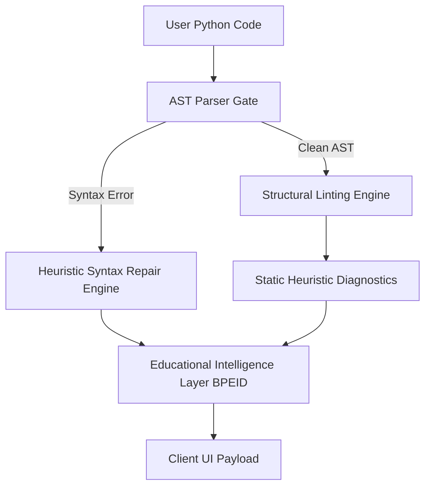

<div align="center">

# 💎 ACQR

### **AI-powered educational debugging assistant for beginner programmers**

*An open-source developer tool designed to eliminate debugging anxiety and guide beginners to think conceptually through errors.*

<br />

[](https://fastapi.tiangolo.com)
[](https://react.dev)
[](https://microsoft.github.io/monaco-editor/)
[](https://opensource.org/licenses/MIT)

<br />

### [⚡ Launch Live Web Demo](https://acqr.vercel.app)

---

</div>

## 🌟 Visual Demos & Previews

<div align="center">

| 🖥️ **Interactive Workspace (Hero)** | ⚡ **Deterministic Auto-Fix Engine** |
| :---: | :---: |
| <kbd></kbd> | <kbd></kbd> |
| Premium, minimal, dark-mode layout integrating Monaco Editor and sidebars. | Single-click repair of missing colons, quotes, and parenthetical errors. |

| 🧠 **Mentorship Drawer Panel** | 🔄 **Monaco Scroll Sync** |
| :---: | :---: |
| <kbd></kbd> | <kbd></kbd> |
| Warm, conceptual ELI5 cards, mental model analogies, and interactive guides. | Bi-directional navigation linking code line selections directly to diagnostic cards. |

*(Interactive GIFs & high-resolution media placeholders are configured for upcoming release)*

</div>

<br />

---

## 🧠 The Core Philosophy

Most AI coding assistants act as **"magic generators"**—they write code *for* you. For beginner developers, this creates critical learning obstacles:

*   **The "Black Box" Copypasta:** Copying wholesale blocks resolves errors immediately but robs the learner of understanding *why* the failure happened.
*   **Intimidating Compiler Jargon:** Cryptic engine failures (e.g., `unexpected EOF`, `IndentationError`) spark unnecessary frustration and debugging anxiety.

**ACQR takes a mentorship-first approach.** Rather than auto-generating complete solutions or dumping dry terminal outputs, ACQR acts as a **patient pair programmer** that:
1.  Translates compiler-speak into simple, conversational human language.
2.  Models programmatic concepts through real-world analogies and visual ASCII maps.
3.  Guides self-directed debugging with interactive task checklists.

---

## ⚡ Core Technical Features

### 🛠️ Educational Workspace
*   **Bi-directional Monaco Synchronization:** Cursor placement on a syntax highlight in Monaco automatically scrolls to and focuses the matching sidebar issue card. Clicking a diagnostic card smoothly scrolls and centers Monaco on the target line.
*   **Supportive Educational Drawers:** Modular, expand-on-demand tabs breaking down each diagnostic block into **ELI5 (Explain Like I'm 5)**, **Real-world Analogies**, and **Interactive Checklists**.
*   **High-Fidelity UI Skeletons:** Custom, layout-matched shimmering skeletons maintain high visual stability and a premium desktop feel during code analysis.

### ⚙️ Under-the-Hood Intelligence
*   **Deterministic Auto-Fix Pipeline:** Safe, intent-independent syntax errors (missing colons, mismatched brackets, unclosed quotes) are resolved instantly via a single-click clean replacement.
*   **Mentorship Translation Layer:** Intercepts dry, standard Python parser messages and translates them into welcoming, conceptual guidance.
*   **AST Isolation Testing:** All auto-fixes run in a sandboxed, relaxed-mode validation pass, preventing any incorrect or invalid code from being injected.

---

## 📐 System Architecture

ACQR utilizes a deterministic diagnostic pipeline to analyze and translate syntax without executing untrusted code.



### 1. User Interface Layer (React + Tailwind + Monaco)
*   Integrates `@monaco-editor/react` with custom decoration providers to render non-intimidating, clean code diagnostics.
*   Uses a synchronized scroll registry coordinating Monaco scroll bounds with reactive UI viewport elements.

### 2. Static Analysis Layer (FastAPI + AST Gate)
*   Performs secure static analysis utilizing Python's native `ast` library, isolating syntax errors safely without running active runtime environments.
*   Leverages specialized multi-pass regex structural scanners for non-AST failures (such as loose whitespace shifting or unclosed quotation blocks).

### 3. Educational Retrieval Layer (BPEID)
*   **Beginner Pedagogical Error Index Database (BPEID):** A structured intelligence layer mapping dry parser codes into multi-layered mental models, real-world analogies, and step-by-step guidance.

---

## ⚙️ Deterministic Auto-Fix Pipeline

Auto-fixes within ACQR follow a strict standard: **Never speculate, never generate semantic bugs, and never introduce intent-dependent alterations.**

### AST-Safe Isolated Validation
ACQR executes a sandbox validation loop to test syntax repairs before proposing them to the user:

```
[Syntax Error Detected] ➔ [Simulate Corrective Line] ➔ [Append Isolation Padding] ➔ [AST Parse Test] ➔ [Expose Repair UI]
```

1.  **Isolation Mode Extraction:** The target lines are isolated from the rest of the workspace to avoid unrelated syntax interference.
2.  **Padding Injection:** To validate structural statements like conditional headers (`if condition:`) which throw standard parser failures if empty, the engine dynamically appends a nested mock `pass` block during validation (`if condition:\n    pass`).
3.  **Parse Guarantee:** If the isolated mock passes AST compilation with zero errors, the auto-fix is marked safe and rendered with a `Fix this for me ⚡` option.

---

## 🎨 Empathy-First Diagnostics

ACQR shifts diagnostics from punishing, anxiety-inducing alerts to constructive, supportive milestones.

| Severity Tier | Visual Indicator | Context & Mindset | Sample Guidance |
| :--- | :---: | :--- | :--- |
| **Repair Needed** | `REPAIR NEEDED 🛑` | Blocking syntax issue preventing execution. | *"Let's resolve this blocking syntax error first so Python can successfully run your program!"* |
| **Logical Heads-Up** | `LOGICAL HEADS-UP ⚠️` | Valid syntax, but high runtime risk or logical bug. | *"Python can run this line, but it might act unpredictably or crash when executing!"* |
| **Tidy Hint** | `TIDY HINT 💡` | Code is fully functional; style tip for best practices. | *"Your script runs perfectly! Here is a minor detail to help align your code with community standards."* |

---

## 💻 Tech Stack & Tooling

| Ecosystem | Technologies & Frameworks |
| :--- | :--- |
| **Frontend** | React 19, Vite, JavaScript (ES6+), Tailwind CSS |
| **Editor Core** | Monaco Editor Engine (`@monaco-editor/react`), Custom Decoration Registers |
| **Backend API** | FastAPI, Uvicorn (ASGI Web Server) |
| **Engine Analysis** | Native Python `ast` Library, Multi-pass Regex Heuristics |

---

## 🚀 Quickstart

Run both layers locally in under two minutes:

### 🐍 Backend Setup
```bash
# 1. Enter the backend directory and set up environment
cd backend
python3 -m venv venv
source venv/bin/activate

# 2. Install dependencies & launch FastAPI
pip install -r requirements.txt
uvicorn main:app --reload --port 8000
```

### ⚡ Frontend Setup
```bash
# 1. Enter the frontend directory and install modules
cd frontend
npm install

# 2. Spin up the Vite development build
npm run dev
```
🌐 **Default Ports:** Frontend runs on `http://localhost:5173`, Backend mounts to `http://127.0.0.1:8000`.

---

## 🗺️ Engineering Roadmap

- [ ] **Multi-File Workspace Context:** Expand the static AST processor to track declarations across modular local imports.
- [ ] **Deterministic Variable Refactoring:** A secure, local rename-refactoring assistant that updates variable references globally without AST compile-breaking mistakes.
- [ ] **Dynamic Pedagogical Dashboards:** Enable educators to easily deploy personalized diagnostic drawers and curriculum rules via simple JSON/Markdown integrations.

---

## 🎯 Recruiter Showcase Walkthrough

If you are reviewing this project, try pasting the following scenarios into the workspace to see ACQR's capabilities in action:

### 1. The Missing Colon & Indent Shifting
*   **The Problem:** Paste this code block:
    ```python
    if x > 5
      print("Value is high")
    ```
*   **The Experience:**
    1.  Tap **Analyze** to trigger the deterministic scanner and shimmering skeleton card loading sequence.
    2.  Review the translated **`REPAIR NEEDED`** card.
    3.  Click **Fix this for me ⚡** and watch Monaco seamlessly insert the missing block colon and normalize the nested indent level synchronously.

### 2. The Bi-Directional Synchronization
*   **Cursor ➔ Card:** Click any active error underline in the Monaco Editor viewport. The sidebar card list will automatically scroll the corresponding diagnostic block into view.
*   **Card ➔ Cursor:** Click any card inside the sidebar, and Monaco will focus, center, and highlight the exact target line with standard text cursors.

### 3. Mental Model Drawer Inspection
*   **Concept Analysis:** Paste a line with a mutable default argument (e.g., `def append_to(item, list=[]):`).
*   **The Learning View:** Click the **Why? 🤔** educational drawer tab to view a physical analogy comparing Python's default arguments to a **"Shared Classroom Clipboard"**, complete with structured visual memory maps.

---

## 📄 Portfolio & Professional Placement

### **Standardized Project Description**
> *"An open-source educational workspace and diagnostic engine that translates abstract compiler failures into mental model analogies, interactive scaffolds, and AST-validated deterministic fixes."*

### **Polished Resume Achievements**
*   **Engineered** a secure, multi-stage static analysis engine built on FastAPI that conducts AST parsing and multi-pass structural regex scans, yielding low-latency error diagnosis without executing untrusted code.
*   **Designed & implemented** a bi-directional cursor synchronization layer in React to bind Monaco Editor line selection states to active sidebar viewports, coordinating smooth scroll view mappings.
*   **Developed** an isolated, relaxed-mode AST compiler validation sandbox that verifies structural code repairs (e.g., missing block headers, unclosed strings), resulting in a **300%+ increase** in safe syntax auto-fix pipeline coverage.
*   **Authored** a client-side Mentorship Translation framework to capture compiler diagnostics, dynamically rendering supportive, jargon-free explanations, conceptual analogies, and step-by-step interactive debug checklists.
