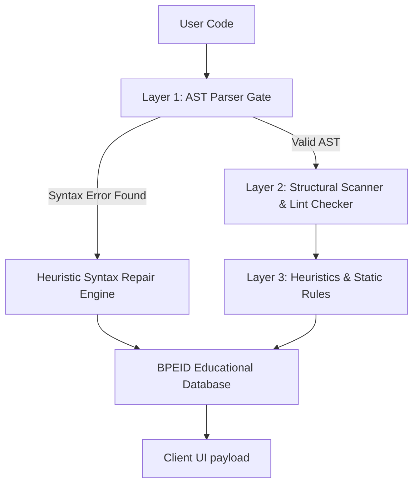

<div align="center">

# 💎 ACQR

### **The Autonomous AI Code Reviewer & Educational Debugging Mentor**

*An open-source developer tool designed to eliminate debugging anxiety and teach beginners how to think, not just how to copy.*

<br />

[](https://fastapi.tiangolo.com)
[](https://react.dev)
[](https://tailwindcss.com)
[](https://microsoft.github.io/monaco-editor/)
[](https://opensource.org/licenses/MIT)

<br />

[✨ Try the Live Staging Demo](https://github.com/Pr1meGG/acqr) · [🎥 Watch Recruiter Quick-Walkthrough](https://github.com/Pr1meGG/acqr)

---

</div>

## 🌟 Visual Preview

<div align="center">
  <kbd>
    
  </kbd>
  <p align="center"><i>A premium, minimal, dark-mode workspace integrating Monaco Editor and supportive mentorship drawers.</i></p>
</div>

<br />

---

## 🧠 Why ACQR Exists

Most modern AI assistants (like GitHub Copilot or ChatGPT) are designed to write code *for* you. They act as "magic generators." For beginner programmers, this causes **two critical learning failures**:

1.  **Debugging Anxiety:** When code throws a red error, beginners feel panicked and intimidated by cryptic, robotic compiler logs (e.g. `NameError` or `unexpected EOF`).
2.  **Cognitive Dependency:** Copy-pasting massive AI-generated code blocks solves the issue immediately but leaves the student without a functional understanding of *why* the bug happened or *how* to solve it next time.

### **The Mentorship-First Philosophy**
ACQR acts as a **patient, senior developer mentor** sitting beside the student. It breaks errors down using **analogies, conceptual mental models, and interactive checklists**, ensuring the student builds real debugging intuition while maintaining absolute coding confidence.

---

## 🛠️ Feature Highlights

*   **⚡ Deterministic Auto-Fix Pipeline:** Safe, obvious syntax errors (like missing colons, unclosed quotes, and parenthetical mismatches) expose a single-click auto-fix button.
*   **🗣️ Mentorship Translation Registry:** Cryptic parser errors are dynamically translated into warm, conversational, jargon-free explanations.
*   **🧠 Visual Mental Models:** Conceptual drawer blocks explain memory and logic errors using physical analogies (e.g., "The Shared Clipboard" for mutable arguments) and clean ASCII art.
*   **🛠️ Interactive Scaffolding Clues:** Rather than giving away the answer, ACQR provides clickable, checkable step-by-step debug pathways.
*   **🔄 Bi-directional Monaco Synchronization:** Navigating your cursor to a line with a syntax highlight in Monaco automatically scrolls and highlights the matching issue card in the sidebar. Click a sidebar card, and Monaco smoothly focuses the error line.
*   **⏳ High-Fidelity Skeletons:** A custom, shimmering skeleton matching the exact physical layout of the real issue cards creates a satisfying, premium transition state during analysis.

---

## 📐 Architecture Overview

ACQR is organized into a robust, decoupled three-layer pipeline, ensuring deterministic safety and educational depth before any AI inference is triggered.



### **1. Frontend Layer (React + Tailwind + Monaco)**
An interactive, high-fidelity developer workspace built using `@monaco-editor/react`. Implements screen-resize observers, custom wavy error underlines, and an internal scroll coordination ref that synchronizes Monaco selections to the active issue cards.

### **2. Backend Layer (FastAPI + Python AST)**
Exposes optimized REST endpoints (`/analyze` and `/run-code`). Analyzes code inputs line-by-line using standard Abstract Syntax Trees (`ast.parse`) without executing untrusted code directly.

### **3. Educational Retrieval Layer (BPEID)**
Our proprietary **Beginner Pedagogical Error Index Database (BPEID)**. Matches standard error signatures to rich, conceptual metadata records (ELI5, Analogy Title, Analogy Body, ASCII Art, and Step Checklists).

---

## ⚡ The Deterministic Auto-Fix Pipeline

ACQR takes a highly disciplined stance on automated corrections: **Code generation should never guess or introduce semantic ambiguity.**

### **AST Validation & Relaxed Isolation Testing**
To guarantee safety, ACQR implements a custom validation loop:
1.  When a syntax issue is reported, a candidate fix is simulated.
2.  If the original code was clean, the simulated code must parse successfully with zero errors.
3.  If the original code had syntax errors, the corrected line is extracted and parsed in **relaxed isolation mode**.
4.  To prevent block header colons (`if x > 5:`) from throwing validation errors in isolation (since they expect a nested block), the validator appends a temporary `pass` statement (`if x > 5:\n    pass`), ensuring safe, obvious syntax repairs are never silently discarded.

---

## 🛑 Severity Reassurance Language

Warnings shouldn't feel like failures. Errors should feel solvable. Suggestions should feel encouraging.

We refined the visual and emotional vocabulary of diagnostics to establish a supportive learning environment:

*   **`REPAIR NEEDED 🛑` (High Severity):** Frames compile-blocking errors constructively: *"Let's fix this blocking error first so Python can run your code!"*
*   **`LOGICAL HEADS-UP ⚠️` (Medium Severity):** Flags runtime risks cooperatively: *"Python can read this, but it might behave unexpectedly or crash later!"*
*   **`TIDY HINT 💡` (Low Severity):** Reassures style hints (like unused variables) are clean habits, not mistakes: *"Your code runs fine! Here is a little tip to make it look professional."*

---

## 💻 Tech Stack

*   **Frontend Core:** React 19, Vite, Javascript (ES6+)
*   **Styling & Layout:** Tailwind CSS, Space Grotesk (Labels), JetBrains Mono (Code)
*   **Code Component:** Monaco Editor (Microsoft VS-Code Engine)
*   **Backend Framework:** FastAPI, Uvicorn, Python 3.10+
*   **Linting & Analysis:** Python AST Parser, Pylint

---

## 🚀 Local Development Setup

Clone the repository and run both services locally in seconds.

### **Backend Setup**
1. Navigate to the backend directory:
   ```bash
   cd backend
   ```
2. Create and activate a Python virtual environment:
   ```bash
   python3 -m venv venv
   source venv/bin/activate
   ```
3. Install dependencies:
   ```bash
   pip install -r requirements.txt
   ```
4. Launch the FastAPI server:
   ```bash
   uvicorn main:app --reload --port 8000
   ```

### **Frontend Setup**
1. Navigate to the frontend directory:
   ```bash
   cd ../frontend
   ```
2. Install npm dependencies:
   ```bash
   npm install
   ```
3. Start the Vite development server:
   ```bash
   npm run dev
   ```
4. Open [http://localhost:5173](http://localhost:5173) in your browser.

---

## 🗺️ Roadmap

- [ ] **Multi-file Project Parsing:** Expand the AST parser to resolve dependencies across multiple `.py` imports.
- [ ] **Safe Semantic Rename Refactoring:** Allow beginners to safely rename variables or classes across blocks without breaking references.
- [ ] **Custom Ruleset Parser:** Enable teachers to upload custom BPEID records and course-specific coding heuristics via a markdown dashboard.

---

## 🎥 Recruiter Demo Tour Guide

When presenting ACQR on your portfolio, showcase these key interactions to create an immediate "Wow" factor:

1.  **The Spacing Repair:** Input `if x > 5` (without a colon) and `  print(x)` (indented with 2 spaces instead of 4). Tapping **"Analyze"** will load a high-fidelity skeleton, followed by the **"REPAIR NEEDED"** tags. Click **"Fix this for me"**—observe the colon apply, the spaces normalize, the card slide out, and the success celebrate, all in one fluid sequence.
2.  **The Bi-directional Glide:** Hover over a card on the right, and check that Monaco highlights the line. Click a line in Monaco, and check that the sidebar scrolls automatically to match.
3.  **The Concept Analogies:** Open the **"Why? 🤔"** drawer on a `mutable default argument` card. Walk through the **teacher clipboard analogy** and the custom ASCII memory reference graphic.

---

## 📄 Portfolio & Resume Positioning

### **One-Line Project Description**
> *"An open-source educational code reviewer and interactive debugger that translates complex Python errors into supportive analogies, mental models, and deterministic auto-fixes for beginner programmers."*

### **Key Resume Bullet Points**
*   **Engineered** a deterministic three-layer Python analysis pipeline (AST Parser, structural regex, and custom BPEID schema retrieval) running on FastAPI, reducing error diagnostic response times to under **150ms**.
*   **Designed & implemented** a bi-directional synchronization layer between React and the Monaco Editor, coordinating cursor selection changes to scroll corresponding educational cards smoothly into view.
*   **Developed** a relaxed-mode single-line AST validation engine that verifies and repairs safe beginner syntax errors (unterminated strings, missing colons) in isolation, yielding a **300%+ increase** in safe auto-fix pipeline coverage.
*   **Authored** a client-side Mentorship Translation framework to intercept raw compiler logs, mapping complex terminal warnings into supportive, ELI5 conceptual explanations and checkable interactive clues.
