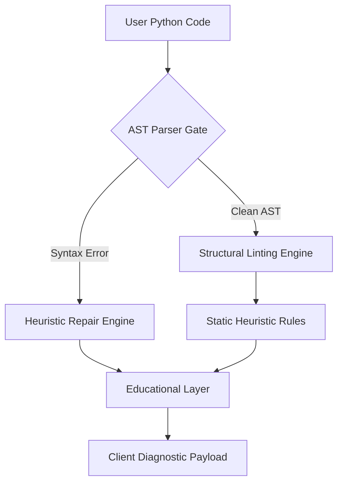

<div align="center">

# ACQR

### A quiet tutor for Python.

Paste a few lines. ACQR reads them with you — what the code is doing, the line that needs work, and how to fix it. It does not write the program for you. It does not shout compiler output. It teaches.

<br />

[](https://acqr-kappa.vercel.app/)
[](https://fastapi.tiangolo.com)
[](https://react.dev)
[](https://microsoft.github.io/monaco-editor/)
[](https://opensource.org/licenses/MIT)

<br />

[](https://acqr-kappa.vercel.app/)

</div>

---

## Why it exists

Most AI coding tools write code *for* you. For someone just starting out, that leaves two problems:

- **A pasted fix never explains why.** You get working code, but you don't learn why the error happened or how to avoid it next time.
- **Compiler output scares before it teaches.** Raw traceback messages like `unexpected EOF while parsing` or `IndentationError: unindent does not match any outer indentation level` alienate beginners.

ACQR sits right next to your editor. It translates the Python parser into plain language, grounds each error in a real-world mental model, and walks you through the repair — without handing over the direct answer.

---

## Workspace

Code on the left. Lessons on the right. Terminal docks at the bottom when you need to execute.

- **Bi-directional navigation** — Click a highlighted line in Monaco to jump straight to its diagnostic card. Click a card to focus the exact line in the editor.
- **Deep mental models** — Every diagnostic expands into what the line is doing, why it fails, an intuitive analogy, and a step-by-step debug checklist.
- **Interactive Terminal** — Powered by `xterm.js` and WebSockets to stream real-time Python execution with full line-buffered `input()` support right in the browser.
- **Optimization Hacks** — Minor style or performance advice (like float vs. integer square roots) is grouped under "Optimization Hacks" so it never clutters your view of critical syntax errors.
- **AST-Validated Auto-Fix** — One-click repairs for unambiguous syntax errors (missing colons, broken indents) are verified against an isolated AST parser before appearing.

---

## How analysis works

ACQR processes code statically using Python's native `ast` module before execution, pairing parser inspection with safe heuristic repairs.


```mermaid
graph TD
    A[User Python Code] --> B{AST Parser Gate}
    B -- Syntax Error --> C[Heuristic Repair Engine]
    C --> D[Educational Layer]
    B -- Clean AST --> E[Structural Linting Engine]
    E --> F[Static Heuristic Rules]
    F --> D
    D --> G[Client Diagnostic Payload]
```

1. **AST Parser Gate** — Code is parsed without running it. Syntactically valid code moves directly to structural analysis.
2. **Heuristic Repair Engine** — If syntax fails, multi-pass regex rules attempt safe line repairs (such as appending missing colons or adjusting indentation).
3. **Isolated Validation** — Fix proposals are validated in an isolated Python subprocess AST check to guarantee they produce clean code before being offered as an option.
4. **Educational Layer** — Raw parser diagnostics are translated into human-readable explanations, analogies, and actionable checklists.

---

## Diagnostic Tiers

| Tier | Badge | Meaning |
| :--- | :--- | :--- |
| **High** | `REPAIR NEEDED 🛑` | Critical syntax error — code cannot run until resolved. |
| **Medium** | `LOGICAL HEADS-UP ⚠️` | Valid syntax, but prone to runtime exceptions or logic bugs. |
| **Low** | `OPTIMIZATION HACK ✨` | Code runs fine. Includes advice for performance or style improvements. |

---

## Tech Stack

- **Frontend:** React 19, Vite, Vanilla CSS (Glassmorphism design system)
- **Editor & Console:** Monaco Editor (`@monaco-editor/react`), Xterm.js (`@xterm/xterm`)
- **Backend:** FastAPI, Uvicorn, WebSockets
- **Analysis:** Python `ast` module, isolated AST candidate parser, regex heuristics

---

## Local Setup

### Prerequisites
- Python 3.10+
- Node.js 18+

### 1. Clone & install backend
```bash
cd backend
python3 -m venv venv
source venv/bin/activate  # On Windows: venv\Scripts\activate
pip install -r requirements.txt
uvicorn main:app --reload --port 8000
```

### 2. Install frontend & run
```bash
cd frontend
npm install
npm run dev
```

Open `http://localhost:5173` in your browser.

---

## Try it out

Open the [live demo](https://acqr-kappa.vercel.app/) and test one of these examples:

**1. Syntax repair**
```python
if x > 5
    print("Greater than five")
```
Click **Review**, select the card, and hit **Apply Fix**. ACQR inserts the colon and cleans up the indentation.

**2. Mental model drawer**
```python
def is_prime(n):
    for i in range(3, int(n**0.5) + 1, 2):
        if n % i == 0:
            return False
    return True
```
Click **Review** to see the low-severity **Optimization Hack** explaining precision in integer square roots (`n**0.5` vs integer methods).

---

## License

MIT
