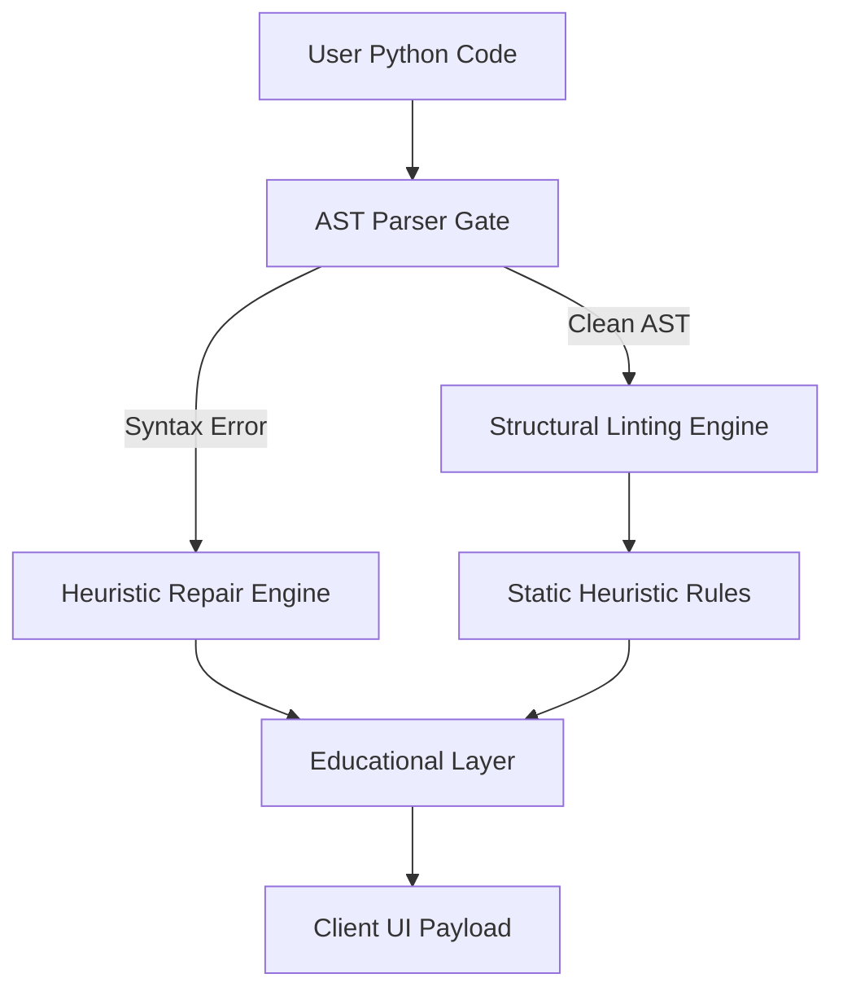

<div align="center">

# 💎 ACQR

### **AI-powered educational debugging assistant for beginner programmers**

*Open-source. Mentorship-first. Built to teach, not to replace.*

<br />

[](https://fastapi.tiangolo.com)
[](https://react.dev)
[](https://microsoft.github.io/monaco-editor/)
[](https://opensource.org/licenses/MIT)

<br />

**[⚡ Try the Live Demo →](https://acqr-kappa.vercel.app/)**

<br />

[](https://acqr-kappa.vercel.app/)

</div>

---

## Why ACQR Exists

Most AI coding tools write code *for* you. For beginners, that creates two problems:

- **Errors stay mysterious.** Copy-pasting a fix doesn't explain *why* it happened or how to avoid it next time.
- **Compiler output is intimidating.** Messages like `unexpected EOF` or `IndentationError` cause anxiety before understanding.

ACQR takes a different approach: **explain the error, teach the concept, guide the fix.** It acts as a patient pair programmer—translating compiler output into plain language, grounding concepts in real-world analogies, and providing step-by-step debug guidance rather than handing over answers.

---

## Features

**Workspace**
- **Interactive Terminal** — Powered by `xterm.js` and WebSockets, you can run fully interactive Python scripts (like using `input()`) seamlessly inside the browser.
- **Bi-directional Monaco sync** — clicking a line scrolls to its diagnostic card; clicking a card focuses the line in the editor.
- **Expandable learning drawers** — each issue opens into an ELI5 explanation, a real-world analogy, and an interactive debug checklist.
- **Optimization Hacks** — Minor inefficiencies (like using floats for integer math) are elegantly tucked away as "Optimization Hacks" rather than presented as scary errors.

**Analysis Engine**
- **Deterministic auto-fix pipeline** — safe, unambiguous syntax errors (missing colons, unclosed strings) get a one-click fix. Nothing speculative is applied.
- **Mentorship translation layer** — raw Python parser messages are rewritten into calm, beginner-friendly guidance.
- **AST-isolated validation** — candidate fixes are validated in isolation before being surfaced to the user.

---

## Architecture

ACQR focuses on powerful static analysis workflows and interactive execution via WebSockets.


```mermaid
graph TD
    A[User Python Code] --> B[AST Parser Gate]
    B -- Syntax Error --> C[Heuristic Repair Engine]
    C --> D[Educational Layer]
    B -- Clean AST --> E[Structural Linting Engine]
    E --> F[Static Heuristic Rules]
    F --> D
    D --> G[Client UI Payload]
```

**1. UI Layer — React + Vanilla CSS + Monaco + Xterm**
Custom glassmorphism design system using highly polished Vanilla CSS. `@monaco-editor/react` handles the code, while `@xterm/xterm` handles the interactive runtime console.

**2. Static Analysis Layer — FastAPI + AST**
Python's native `ast` library parses code without executing it. Multi-pass regex scanners handle non-AST failures (whitespace shifts, unclosed strings).

**3. Interactive Execution Layer — WebSockets**
FastAPI WebSockets streams a true `subprocess` environment in real-time back to the frontend, supporting native `input()` interactions and live `stdout`.

---

## Auto-Fix Pipeline

Fixes follow one rule: **never speculate.** A fix is only surfaced after passing AST validation in isolation.

```
Syntax Error → Simulate Fix → Isolate Line → AST Parse → Surface "Apply Fix ⚡"
```

Block headers like `if x > 5:` are validated with a temporary `pass` body to avoid false negatives in isolation mode.

---

## Diagnostic Severity

| Tier | Label | What it means |
| :--- | :--- | :--- |
| High | `REPAIR NEEDED 🛑` | Blocking syntax — Python can't run yet. |
| Medium | `LOGICAL HEADS-UP ⚠️` | Parses fine, but likely to crash or misbehave at runtime. |
| Low | `OPTIMIZATION HACK ✨` | Code works. A small, advanced improvement is available. |

---

## Tech Stack

| Layer | Tools |
| :--- | :--- |
| Frontend | React 19, Vite, JavaScript (ES6+), Vanilla CSS |
| Editor / Console | Monaco Editor (`@monaco-editor/react`), Xterm.js |
| Backend | FastAPI, Uvicorn, WebSockets |
| Analysis | Python `ast`, multi-pass regex heuristics |

---

## Quickstart

```bash
# Backend
cd backend
python3 -m venv venv && source venv/bin/activate
pip install -r requirements.txt
uvicorn main:app --reload --port 8000

# Frontend — separate terminal
cd frontend
npm install && npm run dev
```

Frontend: `http://localhost:5173` · Backend: `http://127.0.0.1:8000`

---

## Roadmap

- [ ] Multi-file AST context — track variable declarations across local imports
- [ ] Safe rename refactoring — update all references without breaking AST structure
- [ ] Broader coverage for runtime and logical error classes

---

## Try It

Open the [live demo](https://acqr-kappa.vercel.app/) and paste one of these:

**Syntax repair**
```python
if x > 5
  print("Value is high")
```
Hit **Review** → review the card → click **Apply fix**. The colon is inserted and the indent corrected in one step.

**Mental model drawer**
Paste `def append_to(item, list=[]):` and open the **Why it fails** drawer for a conceptual breakdown of mutable default arguments.

---

## License

MIT
