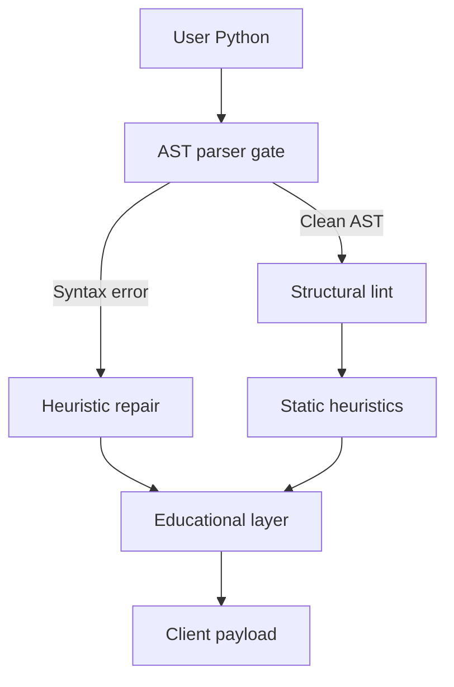

# ACQR

A quiet tutor for Python.

Paste a few lines. ACQR reads them with you — what the code is doing, the line that needs work, and how to fix it. It does not write the program for you. It does not shout compiler output. It teaches.

[Live demo](https://acqr-kappa.vercel.app/)

---

## Why it exists

Most AI coding tools write code for you. For someone just starting, that leaves two holes:

- A pasted fix never explains why the error happened, or how to avoid it next time.
- Messages like `unexpected EOF` or `IndentationError` scare before they teach.

ACQR sits next to the editor. It translates the parser into plain language, grounds the concept in a mental model, and walks through the repair — instead of just handing over the answer.

---

## Workspace

Code on the left. Lesson on the right. An interactive terminal docks at the bottom when you need it.

- **Interactive Execution:** The built-in terminal isn't just a static log. Powered by WebSockets and `xterm.js`, it supports fully interactive execution (like `input()` prompts) and streams outputs in real-time.
- **Contextual Lessons:** Click a marked line and the matching diagnostic comes into view. Click a card and the editor focuses that line.
- **Deep Explanations:** Each issue opens into what the line is doing, why it fails, a mental model, and a short checklist.
- **Jank-Free UI:** Layout-matched skeletons hold the pane while analysis runs. The page does not jump.

---

## Analysis

ACQR diagnoses without executing your code.


```mermaid
graph TD
    A["User Python"] --> B["AST parser gate"]
    B -- "Syntax error" --> C["Heuristic repair"]
    C --> D["Educational layer"]
    B -- "Clean AST" --> E["Structural lint"]
    E --> F["Static heuristics"]
    F --> D
    D --> G["Client payload"]
```

**Parser gate.** Python `ast` parses the snippet. If the tree cannot be built, a heuristic pass still looks for missing colons, unclosed strings, and mismatched brackets.

**Repair.** A fix is only offered after it parses in isolation. Nothing speculative is applied. Block headers such as `if x > 5:` are checked with a temporary `pass` body so isolation does not reject a valid header.

**Lesson.** Parser codes map to structured records: a plain-language explanation, an analogy, a small diagram, and a debug checklist.

```
Syntax error → simulate fix → isolate the line → AST parse → surface Apply fix
```

---

## Severity

| Tier | Label | Meaning |
| --- | --- | --- |
| High | Repair needed | Blocking syntax. Python cannot run yet. |
| Medium | Logical heads-up | Parses, but is likely to crash or misbehave. |
| Low | Tidy hint | It runs. A small optimization or improvement is available. |

Low-severity notes (like optimization hacks) stay folded. They are not dressed up as scary errors.

---

## Stack

| Layer | Tools |
| --- | --- |
| Studio | React, Vite, JavaScript |
| Editor | Monaco (`@monaco-editor/react`) |
| Terminal | `xterm.js` |
| Styles | Vanilla CSS |
| API | FastAPI, Uvicorn, WebSockets |
| Analysis | Python `ast`, multi-pass heuristics |

---

## Run it locally

Node 18+ and Python 3.10+.

```bash
# API
cd backend
python3 -m venv venv
source venv/bin/activate
pip install -r requirements.txt
uvicorn main:app --reload --port 8000
```

```bash
# Studio
cd frontend
npm install
npm run dev
```

Studio: `http://localhost:5173`  
API: `http://127.0.0.1:8000`

---

## Try it

Open the [demo](https://acqr-kappa.vercel.app/) and paste:

```python
if x > 5
  print("Value is high")
```

Press **Review**. Read the repair card. **Apply fix** inserts the colon and corrects the indent in one step.

Paste `def append_to(item, list=[]):` and open **Why it fails** for a lesson on mutable default arguments.

---

## Next

- Multi-file AST context across local imports
- Safe rename that updates every reference without breaking the tree
- Broader coverage for runtime and logical error classes

---

## License

MIT
